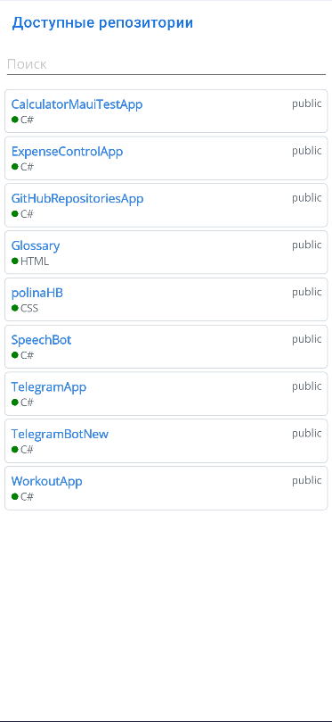

# Репозитории GitHub
Приложение MAUI, соответствующий принципам чистой архитектуры.

# Technologies
- [.NET 8 MAUI](https://github.com/dotnet/maui)
- [Community Toolkit Maui](https://docs.microsoft.com/en-us/ef/core/](https://github.com/CommunityToolkit/Maui))
- [Community Toolkit MVVM](https://github.com/jbogard/MediatR](https://github.com/CommunityToolkit/dotnet))

# Описание
При первом запуске вызывается GitHub Api для получения доступных репозиториев.
При повторном открытии данные загружаются из локальной папки на утройстве.
Локальное хранение реализовано сохранением json в локальную папку на устройстве.

Приложение состоит из двух экранов. 

**Первый страницы - отображение доступных репозиторием и поиска**

**Второй страница - подробная информация о репозитории**

 
 
 

